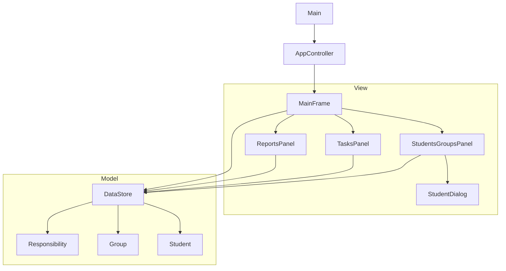

# Group Project Management System

A desktop application built using **Java Swing** and **AWT** following the **Model-View-Controller (MVC)** architectural pattern. Developed as an academic assignment for the Object-Oriented Programming (OOP) course at Ahmadu Bello University.

---

## Table of Contents
- [Overview](#overview)
- [Key Features](#key-features)
- [Architecture & Design](#architecture--design)
- [GUI Components Used](#gui-components-used)
- [Project Structure](#project-structure)
- [Compilation & Execution](#compilation--execution)
- [Academic Information](#academic-information)

---

## Overview

The **Group Project Management System** allows course instructors to:
- Maintain student records and organize them into project groups.
- Define, assign, and track responsibilities (tasks) per group member.
- Monitor individual contributions and calculate completion percentages automatically.
- Generate formatted progress and contribution reports.

All application data is managed in-memory using standard Java collections (`ArrayList`, `List`) without external dependencies or database persistence.

---

## Key Features

1. **Student Management**
   - Add, edit, and delete student entries (`ID`, `Name`, `Email`).
   - Display students in an interactive, non-editable `JTable`.
   - Assign students to project groups with real-time UI updates.

2. **Group Management**
   - Create groups with custom names and descriptions.
   - Enforce business logic: A student can belong to only one group at a time.
   - View members and group metadata in a split pane (`JSplitPane`).

3. **Responsibility & Task Tracking**
   - Define tasks with titles, descriptions, deadlines, and statuses (`Not Started`, `In Progress`, `Completed`, `Blocked`).
   - Assign tasks to specific group members.
   - Update task statuses interactively through modal dialogs.

4. **Reporting & Data Visualization**
   - **Group Summary Report:** Displays member count, total/completed tasks, and overall group progress.
   - **Member Contribution Report:** Calculates individual completion rates and contribution scores.
   - **Task Status Report:** Tabulates all tasks across all groups in a formatted, monospaced text view.

---

## Architecture & Design

The application follows a clean **Model-View-Controller (MVC)** design pattern:



### Class Responsibilities
- **Model (`model/`)**: Encapsulates data entities (`Student`, `Group`, `Responsibility`) and centralizes state management inside `DataStore`.
- **View (`view/`)**: Manages UI elements (`MainFrame`, `StudentsGroupsPanel`, `TasksPanel`, `ReportsPanel`, `StudentDialog`).
- **Controller (`controller/`)**: Coordinates application startup and event delegation using thread-safe execution via `SwingUtilities.invokeLater`.

---

## GUI Components Used

The interface leverages **14 distinct Swing/AWT components** across **4 layout managers**:

| Component | Usage Location | Layout / Role |
| :--- | :--- | :--- |
| `JFrame` | `MainFrame` | Top-level application window (`BorderLayout`) |
| `JTabbedPane` | `MainFrame` | Primary navigation container |
| `JPanel` | All views | Sub-containers (`BorderLayout`, `GridLayout`, `FlowLayout`, `GridBagLayout`) |
| `JTable` | `StudentsGroupsPanel`, `TasksPanel` | Displaying tabular data for students and tasks |
| `JList` | `StudentsGroupsPanel` | Single-selection group list |
| `JTextArea` | `StudentsGroupsPanel`, `ReportsPanel` | Multiline view for group details and formatted reports |
| `JTextField` | `StudentDialog` | User input fields |
| `JButton` | All views | Primary trigger actions |
| `JComboBox` | `TasksPanel` | Dropdown selection for groups, assignees, and task statuses |
| `JLabel` | All views | Descriptive text labels |
| `JScrollPane` | All views | Enables scrolling for tables, lists, and text areas |
| `JMenuBar` / `JMenu` / `JMenuItem` | `MainFrame` | System menu navigation ("File" -> "Exit", "Help" -> "About") |
| `JDialog` | `StudentDialog` | Modal dialog for input prompts |
| `JSplitPane` | `StudentsGroupsPanel` | Horizontal resizable divider between Students and Groups |

---

## Project Structure

```text
.
├── src/
│   ├── Main.java                   
│   ├── controller/
│   │   └── AppController.java      
│   ├── model/
│   │   ├── DataStore.java          
│   │   ├── Group.java              
│   │   ├── Responsibility.java     
│   │   └── Student.java            
│   └── view/
│       ├── MainFrame.java          
│       ├── ReportsPanel.java       
│       ├── StudentDialog.java      
│       ├── StudentsGroupsPanel.java
│       └── TasksPanel.java         
├── bin/                            
└── README.md                       

```

---

## Compilation & Execution


2. **Compile the Source Code:**
Compile all packages into the `bin/` directory:
```bash
javac -d bin src/model/*.java src/view/*.java src/controller/*.java src/Main.java

```


3. **Run the Application:**
Execute the compiled bytecode:
```bash
java -cp bin Main

```


---

## Academic Information

* **Course:** Object-Oriented Programming (Java)
* **Instructor:** Aliyu Garba (`algarba@abu.edu.ng`)

